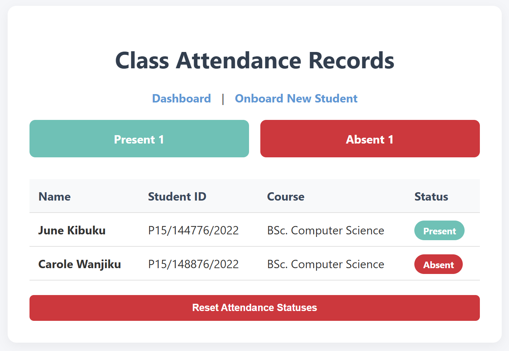
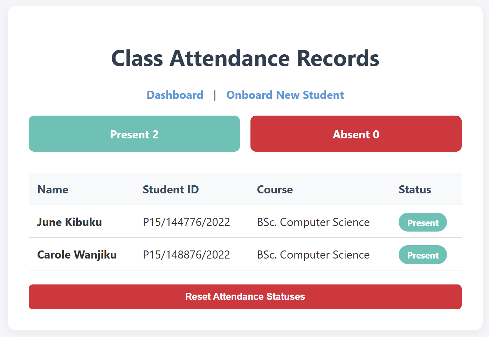
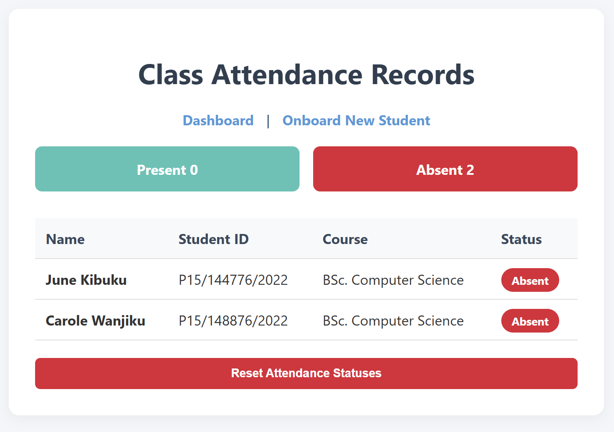

# Project Documentation: Student Attendance Tracker

<span class="week-tag">Final Week · Documentation</span>

## 1. Introduction

This project presents a solution using an ESP32 microcontroller to build an attendance tracking system by combining radio-frequency identification (RFID) technology with an embedded local web server.

---

## 2. Objectives

**Main Objective:** To design and implement an attendance system hosted entirely on an ESP32 microcontroller.

**Specific Objectives:**

* Extract unique hardware serial numbers (UIDs) from RFID fobs/cards using an MFRC522 reader over the SPI protocol.
* Build a local web server interface hosted directly on the chip to display a real-time attendance dashboard.
* Develop an onboarding system to register new student identities directly into flash memory without hardcoding.
* Utilize non-volatile storage partitioning (`Preferences.h`) to ensure system data survives power cycles and reboots.

---

## 3. System Overview

The ESP32 serves as the core processing hub of the operation. It manages a localized full-stack network layout: handling background web requests via standard HTTP protocols, monitoring physical hardware pins hooked up to an RFID reader, parsing data payloads, and saving system configurations directly onto its internal silicon flash sectors.

---

## 4. How It Works (Methodology)

### System Architecture

The project is structured across three core layers:

* **Hardware Inputs/Outputs:** MFRC522 RFID reader (SPI communication array).
* **Processing & Core Storage:** ESP32 Microcontroller managing execution variables inside volatile RAM alongside an internal Non-Volatile Storage (NVS) Flash partition.
* **Network & Interface:** Localized Web Server serving native HTML, CSS, and asynchronous JavaScript (AJAX) layouts directly to devices over local Wi-Fi.

### Operational Logic

```
[Tap RFID Card] ──> [Extract Hex UID] ──> [Query Roster in RAM]
                                                  │
                         ┌────────────────────────┴────────────────────────┐
                 Known Card (Match)                               Unknown Card (No Match)
                         │                                                 │
            Is status already Present?                                     │
             ┌───────────┴───────────┐                                     │
            No                      Yes                                    │
             │                       │                                     │
     [Set to Present]        [Ignore Write]                     [Hold UID in Pending State]
   [Write to NVS Flash]   [Print Serial Alert]                              │
          [Success]          [Silent Pass]                   [Web Polls /check-unregistered]
             │                                                             │
             └───────────────────────┬─────────────────────────────────────┘
                                     ▼
                        [Browser Updates Dashboard]

```

1. **Boot Verification:** On power-up, the ESP32 mounts its non-volatile flash partitions, safely reads the total registered student headcount, and systematically loops through individual keys to reconstruct the active roster arrays inside its running RAM memory cells.
2. **Card Detection:** When an RFID credential enters the reader's magnetic proximity field, its binary segment values are extracted, standardized into an alphanumeric Hex String format (e.g., `A3 B2 C1 D0`), and forced into uppercase characters.
3. **Database Evaluation:** The system searches the compiled array list for a matching identifier:
    * **If matched:** The script validates if the student's current flag is something other than `"Present"`. If true, it updates their status inside volatile memory, activates a background flash write operation to preserve the state permanently, and generates a clean, single 150ms success beep.
    * **If unmatched:** The card string is pushed into a temporary `lastScannedUnknownUID` variable bucket, and a rapid double-pulse alert beep sounds to alert the supervisor that a new student is waiting to be registered.
4. **Asynchronous Interface Synchronization:** Any web browser accessing the local IP or domain executes an internal JavaScript loop every 1.5 seconds. It pings a hidden endpoint on the board (`/get-attendance`), fetches a light JSON data package, and updates the dashboard view without reloading the page layout.

---

## 5. Tech Stack & Components

**Hardware Configuration:**

* **ESP32 Development Module:** Dual-core processor handling the Wi-Fi protocol stack and peripheral hardware control.
* **MFRC522 RFID Reader Module:** 13.56 MHz contactless communication reader.
* **CP2102 USB-to-UART Bridge Controller:** Embedded silicon interface allowing serial communications between development environments and the CPU.

**Pin Mapping Matrix:**

* **3.3V** $\rightarrow$ **3V3** *(Power)*
* **GND** $\rightarrow$ **GND** *(Ground reference)*
* **RST** $\rightarrow$ **GPIO 22** *(Hardware Reset)*
* **SDA (SS)** $\rightarrow$ **GPIO 21** *(SPI Slave Select)*
* **MOSI** $\rightarrow$ **GPIO 23** *(SPI Master Out Slave In)*
* **MISO** $\rightarrow$ **GPIO 19** *(SPI Master In Slave Out)*
* **SCK** $\rightarrow$ **GPIO 18** *(SPI Serial Clock)*
* **Buzzer (+)** $\rightarrow$ **GPIO 2** *(Digital PWM Output)*

**Software Stack:**

* **Firmware/Backend Environment:** Arduino IDE (C++ layout architectures) utilizing `WebServer.h`, `ESPmDNS.h`, and `Preferences.h`.
* **Database Engine:** Embedded NVS Flash key-value lookup system split into isolated structural folders (`"db"` for master roster data and `"status"` for daily state logging).
* **Frontend Web Application:** Clean HTML5, responsive CSS3 variables, and Vanilla JavaScript (Asynchronous JSON Fetching/Polling engines).

---

## 6. Expected Outcomes

* A fully functional, wire-mapped embedded hardware terminal tracker.
* A robust local database web panel capable of securely adding student profiles through a clean browser interface over a local Wi-Fi connection.
* Smooth network functionality that automatically redirects browsers utilizing valid `303 See Other` status codes after form collection.
* Zero data loss upon total device power disconnection, allowing complete standalone operations out in the field.

---

## 7. Web Interface & User Flow

The web interface enables administrators to monitor records and onboard new students directly from any local browser. Below is the sequential breakdown of the interface states and operational user flow.

### Step 1: Initial Onboarding State

When navigating to the onboarding portal (`/onboard`) before scanning a new asset, the input form remains safely initialized in a locked, read-only state to prevent premature data errors.

* **UI Behavior:** The card status panel displays a dashed blue informational box reading `"Waiting for Card Scan..."`, and the submit button is grayed out.
* **Mechanism:** JavaScript polls the ESP32 endpoint `/check-unregistered` every $1,000\text{ ms}$ via background API tasks.


### Step 2: Physical Card Detection

The instant an unregistered RFID token is held against the MFRC522 hardware antenna array, the frontend reacts dynamically without reloading.

* **UI Behavior:** The info panel flashes vibrant green, showcasing the extracted hex sequence: `"✅ Card Detected! UID: A1 55 C9 1B"`. The input form elements instantly unlock for typing.
* **Mechanism:** The ESP32 locks the captured hardware string into a temporary memory placeholder. The next browser fetch captures this code, binds it to a hidden form parameter, and updates the user input blocks.


### Step 3: Registration & Redirection

Clicking the registration button commits the structural fields to the database and cleanly loops the system back to the primary view.

* **UI Behavior:** The web portal saves the profile and immediately shifts the user back to the primary landing path (`/`). The student is now listed on the table grid, defaulting to an `"Absent"` flag indicator.
* **Mechanism:** The form executes an HTTP `POST` to `/register`. The backend code logs the parameters into the non-volatile `"db"` namespace folder on the flash drive and answers the browser with an HTTP standard `303 See Other` redirection script.

### Step 4: Live Check-In Tracking

With students logged into flash memory, the system dynamically captures check-ins live.

* **UI Behavior:** When an active student scans their key fob at the reader, their specific row marker turns from a red `"Absent"` indicator into a teal `"Present"` badge. The count summary metrics block at the top updates smoothly in real time.
* **Mechanism:** The home template executes an AJAX loop requesting data from the `/get-attendance` payload route every $1,500\text{ ms}$. The ESP32 returns a clean JSON array structure, which the browser reads to update the layout elements.





### Step 5: Session Reset

At the close of a school class session, administrators can wipe the running slate clean.

* **UI Behavior:** Clicking the dark red command button labeled `"Reset Attendance Statuses"` resets all student list indicators back to a red `"Absent"` layout status and zeroes out the top metrics counters.
* **Mechanism:** The browser issues an HTTP `POST` targeting the `/clear` pathway route. The ESP32 overwrites the data segments back to `"Absent"` inside both runtime RAM variables and the non-volatile `"status"` namespace database partition.

