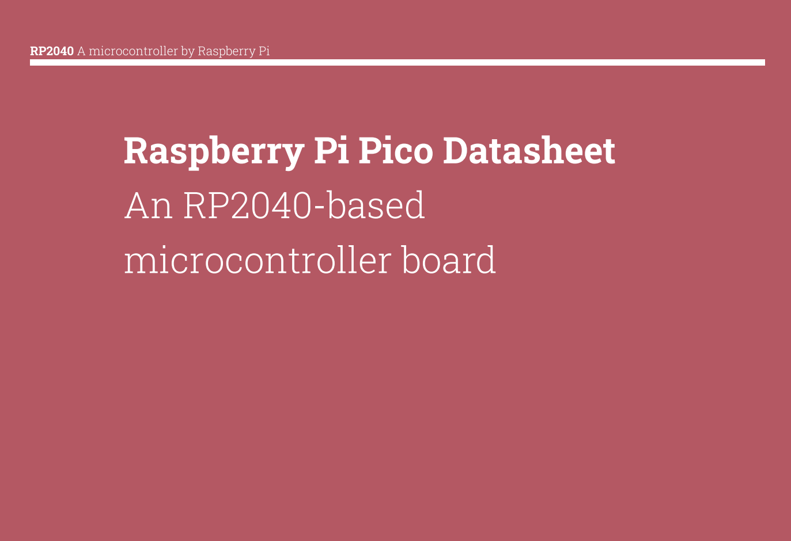
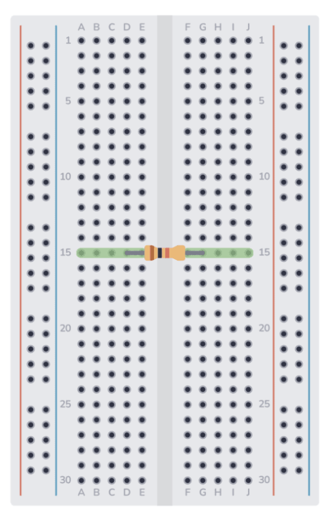
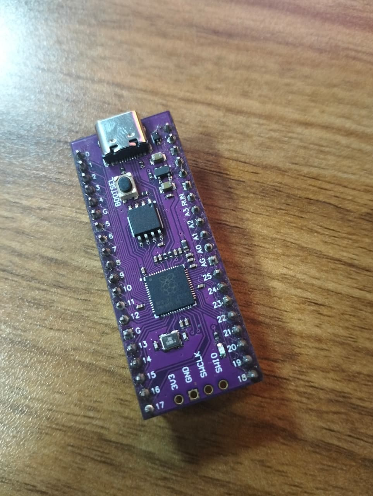

# Week 2 (Wednesday): Hardware Fundamentals

## Objective
Establish a foundational understanding of embedded hardware architecture. The goal was to evaluate chip selection for specific project scopes, and set up the physical prototyping environment.

## Hardware & Tools Evaluated
* **Microcontroller:** Raspberry Pi Pico (Custom RP2040 variant with USB-C)
* **Prototyping:** Breadboards
* **Software/IDE:** Thonny, Arduino IDE
* **Languages:** C, C++, MicroPython

## System Architecture & Hardware Theory
Before writing any firmware, we broke down the physical compute layer and how to make architectural decisions.

### 1. The Compute Hierarchy
* **Microcontrollers (e.g., Raspberry Pi Pico):** Dedicated, real-time control. Bare-metal execution without an operating system.
* **Microprocessors:** The central processing unit (CPU) alone, requiring external memory and peripherals to function.
* **Microcomputers (e.g., Raspberry Pi 4):** Full System-on-Chip (SoC) running an OS (like Linux), used for heavy processing.

### 2. Chip Selection: Pico W vs. ESP32
We analyzed board selection based on the engineering principle of **"Simplicity vs. Overkill"**. While the ESP32 is a powerhouse with built-in Wi-Fi and Bluetooth, a standard Raspberry Pi Pico is often chosen for its simplicity and deterministic I/O when wireless communication isn't strictly necessary. 

### 3. Physical Interfacing
* **Datasheets & Documentation:** The absolute source of truth for pinouts, voltage tolerances, and logic levels.

* **PCBs & Breadboards:** Understood the internal rail structure of a breadboard to transition from theoretical schematics to physical circuits before eventually printing custom Printed Circuit Boards (PCBs).

## Hardware Spotlight
Here is an MCU.

## Firmware Environment
We established the software bridge to the hardware. We are using **MicroPython** via the **Thonny IDE**. This allows for rapid prototyping and testing of logic before optimizing in C.

Interestingly, we also discussed the capability of running Machine Learning directly on these constrained chips (**TinyML**), opening doors for edge AI applications.

## Capstone Definition
We defined the student capstone project: **An End-to-End RFID Access Control System**. All the hardware fundamentals covered will directly apply to building the access logic, physical wiring and micro-processing required for this system.