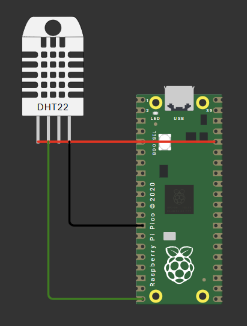

# Week 4 (Wednesday): Temperature & Humidity Sensing and Non-Blocking Logic

## Objective
> To interface the Raspberry Pi Pico with a DHT22 temperature and humidity sensor.

## Hardware Architecture & Wiring
The project was simulated in Wokwi using the following connections:

* **VCC (Power):** Connected to the Pico's `3V3` pin (Red wire).
* **GND (Ground):** Connected to the Pico's `GND.3` pin (Black wire).
* **SDA (Data):** Connected to the Pico's `GP15` pin (Green wire).



## Firmware Implementation
This C code (using the Arduino Core) reads the sensor data and uses an onboard LED (`GP25`) to visually indicate temperature warnings without halting the processor.

```c
/**
 * dht22_sensor.ino — Student Challenges 01–05
 *
 * 01. DELAY_MS = 1000 (read every 1 second)
 * 02. PERFECT status: temp 20–25°C AND humidity 40–60%
 * 03. Failed reading counter printed after each attempt
 * 04. Temperature printed in Fahrenheit (integer math only)
 * 05. ADVANCED: Onboard LED blinks fast=TOO HOT, slow=TOO COLD, off=Comfortable
 */

#include <Arduino.h>
#include <DHT.h>

#define DHT22_PIN   15
#define DELAY_MS    1000    // DHT22 datasheet minimum is 2000ms.
#define LED_PIN     25      // Onboard LED on GP25

#define BLINK_FAST_MS   200     // TOO HOT  — fast blink
#define BLINK_SLOW_MS   1000    // TOO COLD — slow blink

DHT dht(DHT22_PIN, DHT22);

uint32_t reading_count = 0;
uint32_t failed_count  = 0;

// Non-blocking LED state tracking
uint32_t led_last_toggle = 0;
bool     led_state       = false;
int      led_blink_ms    = 0;   // 0 = LED off, >0 = blink interval

void setup() {
    Serial.begin(9600);
    delay(2000);
    dht.begin();
    pinMode(LED_PIN, OUTPUT);
    digitalWrite(LED_PIN, LOW);
}

// LED Update (non-blocking)
void update_led() {
    if (led_blink_ms == 0) {
        digitalWrite(LED_PIN, LOW);
        led_state = false;
        return;
    }

    uint32_t now = millis();
    if (now - led_last_toggle >= (uint32_t)led_blink_ms) {
        led_state = !led_state;
        digitalWrite(LED_PIN, led_state ? HIGH : LOW);
        led_last_toggle = now;
    }
}

void loop() {
    // Always update LED regardless of reading timing
    update_led();

    reading_count++;
    float humidity    = dht.readHumidity();
    float temperature = dht.readTemperature();  // Celsius

    Serial.printf("Reading #%lu:\n", (unsigned long)reading_count);

    if (isnan(humidity) || isnan(temperature)) {
        failed_count++;
        Serial.printf("  Status:      FAILED\n");
        Serial.printf("  Total fails: %lu\n\n", (unsigned long)failed_count);
        led_blink_ms = 0;
    } else {
        // Integer math for Fahrenheit conversion
        int32_t temp_x10 = (int32_t)(temperature * 10.0f);
        int32_t f_x10    = (temp_x10 * 9 / 5) + 320;
        int32_t f_int    = f_x10 / 10;
        int32_t f_frac   = f_x10 % 10;
        if (f_frac < 0) f_frac = -f_frac;

        Serial.printf("  Temperature: %.1f C  /  %ld.%ld F\n", temperature, (long)f_int, (long)f_frac);
        Serial.printf("  Humidity:    %.1f %%\n", humidity);

        const char *status;

        // Climate Logic
        if (temperature > 30.0f) {
            status = "TOO HOT";
            led_blink_ms = BLINK_FAST_MS;
        } else if (temperature < 15.0f) {
            status = "TOO COLD";
            led_blink_ms = BLINK_SLOW_MS;
        } else if (humidity > 70.0f) {
            status = "TOO HUMID";
            led_blink_ms = 0;
        } else if (temperature >= 20.0f && temperature <= 25.0f && humidity >= 40.0f && humidity <= 60.0f) {
            status = "PERFECT";
            led_blink_ms = 0;
        } else {
            status = "Comfortable";
            led_blink_ms = 0;
        }

        Serial.printf("  Status:      %s\n", status);
        Serial.printf("  Total fails: %lu\n\n", (unsigned long)failed_count);
    }
    delay(DELAY_MS);
}
```

## Core Concepts Mastered

### 1. Hardware Polling Limits (The `DELAY_MS` Challenge)
By intentionally setting the `DELAY_MS` to 1000ms, we force the microcontroller to ask the DHT22 for data faster than it can process it (the datasheet specifies a 2000ms minimum). This results in intermittent `NaN` (Not a Number) readings. 

* **Learning Point:** Code executes millions of times faster than physical sensors can react. Firmware must respect hardware timing constraints.

### 2. Non-Blocking Logic (`millis()` vs `delay()`)
Using `delay(1000)` stops the entire processor for one full second. If we used `delay()` to blink our warning LED, it would pause the sensor readings too.

* **Learning Point:** We used `millis()` to check how much time has passed since the LED last toggled (`now - led_last_toggle >= led_blink_ms`). This allows the main loop to keep running infinitely fast, only toggling the LED when the exact interval has elapsed.

### 3. Floating-Point Optimization (Integer Math)
Microcontrollers (like the RP2040) do not always have native hardware support for fast floating-point decimals. Doing math with `float` types is computationally expensive.

* **Learning Point:** To calculate Fahrenheit $F = (C \times \frac{9}{5}) + 32$, we multiplied the Celsius reading by 10 to turn it into a whole integer. We did all the math as integers, and only split it back into whole and fractional parts right before printing.

### 4. Complex Control Flow
Evaluated multiple environmental states using nested `if/else if` blocks. The code successfully implements compound boolean logic (using `&&`) to determine if the climate sits exactly inside the narrow "PERFECT" band.