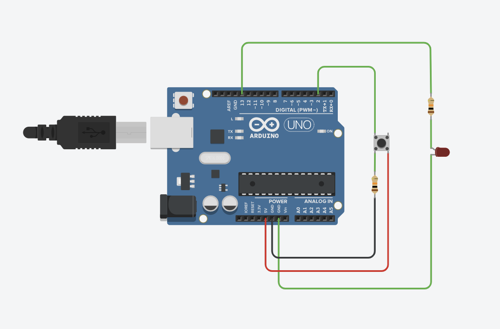

# Week 4 (Monday): Digital Inputs and State Logic

## Objective
> To design an interactive control panel using an Arduino UNO. This assignment focuses on reading digital inputs from push buttons, understanding the necessity of pull-down resistors, and writing conditional firmware to handle both momentary and toggled state changes.

## Circuit Design & Simulation
The hardware was prototyped and simulated using TinkerCAD. 

**[View the interactive TinkerCAD simulation here](https://www.tinkercad.com/things/hQGLti0kJuM-week05monday)**

### Hardware Requirements
* 1 × Arduino UNO
* 1 × LED
* 1 × 220Ω Resistor (LED current limiting)
* 1 × Push Button
* 1 × 10kΩ Resistor (Button pull-down)



---

## Hardware Theory (Submission Requirements)

### How the Button Works
A push button is a mechanical switch that bridges two contacts when pressed. In this circuit, it acts as a gatekeeper for the 5V signal. When pressed, the circuit closes, and 5V flows to Digital Pin 2, registering as a `HIGH` signal in the software. When released, the connection breaks.

### Why Resistors are Needed
Resistors are critical here for two completely different reasons:

1. **The 220Ω LED Resistor:** LEDs draw as much current as possible until they destroy themselves. The 220Ω resistor limits the current flow, protecting both the LED from burning out and the Arduino pin from overloading.
2. **The 10kΩ Pull-Down Resistor:** Without this, when the button is unpressed, Digital Pin 2 isn't connected to anything—it is "floating" and acts like an antenna, picking up random electrical noise and causing unpredictable `HIGH` or `LOW` readings. The 10kΩ resistor ties the pin to Ground (0V), ensuring a reliable, deterministic `LOW` state when the button is open.

### Challenges Encountered
The transition from momentary control (Part 1) to toggle control (Part 2) was an interesting architectural challenge. It required shifting from simply asking "Is the button pressed right now?" to asking "Did the button *just change* from unpressed to pressed?" Tracking the historical state of the hardware required introducing global variables to remember the past.

---

## Firmware Implementation

### Part 1: Momentary Control (Basic Input)
This firmware turns the LED on *only* while the button is actively held down.

```cpp
// ==============================
// Pin definitions
// ==============================
const int buttonPin = 2; 
const int ledPin = 13;

void setup() {
  pinMode(buttonPin, INPUT);  // Pin 2 listens for voltage (Input)
  pinMode(ledPin, OUTPUT);    // Pin 13 pushes voltage (Output)
  Serial.begin(9600);         // Initialize debugging console
}

void loop() {
  // Read current state (HIGH = pressed, LOW = unpressed)
  int buttonState = digitalRead(buttonPin);

  // ==========================
  // PART 1: BASIC CONTROL
  // ==========================
  if (buttonState == HIGH) {
    digitalWrite(ledPin, HIGH); // Send 5V to LED
  } else {
    digitalWrite(ledPin, LOW);  // Turn LED off
  }
}
```

### Part 2: Toggle Logic (State Change Detection)
This firmware acts like a traditional light switch. Pressing the button once turns the LED on, and it stays on until the button is pressed again. This requires tracking the "Rising Edge" (the exact moment the signal goes from LOW to HIGH).

```cpp
// ==============================
// Pin definitions & Globals
// ==============================
const int buttonPin = 2; 
const int ledPin = 13;

int ledState = LOW;         // Tracks if the LED is currently ON or OFF
int lastButtonState = LOW;  // Tracks the historical state of the button

void setup() {
  pinMode(buttonPin, INPUT); 
  pinMode(ledPin, OUTPUT);
  Serial.begin(9600);
}

void loop() {
  int buttonState = digitalRead(buttonPin);

  // ==========================
  // PART 2: TOGGLE LOGIC
  // ==========================
  
  // Check if the button state has changed since the last loop
  if (buttonState != lastButtonState) {
    
    // Check if the change was from LOW to HIGH (Rising Edge)
    if (buttonState == HIGH) {
      // Flip the current LED state
      if (ledState == LOW) {
        ledState = HIGH;
      } else {
        ledState = LOW;
      }
      
      // Write the new state to the hardware
      digitalWrite(ledPin, ledState);
    }
    
    // A tiny delay to "debounce" the mechanical switch 
    // (prevents one press from counting as multiple rapid presses)
    delay(50);
  }

  // Update history for the next loop iteration
  lastButtonState = buttonState;
}
```