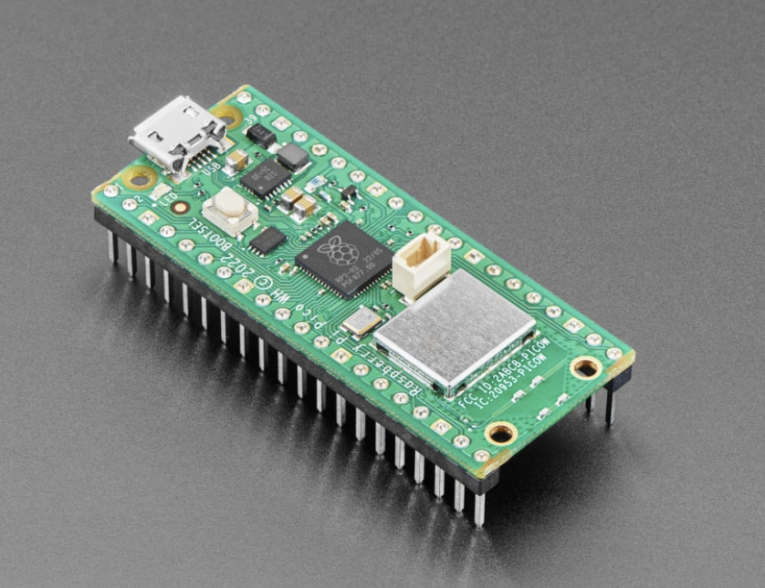
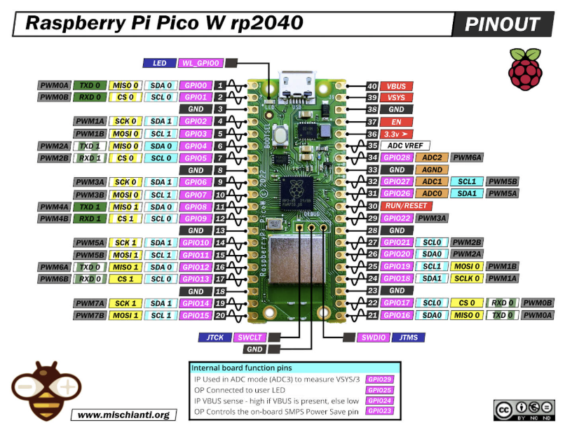

# Week 6 (Monday): Raspberry Pi Pico W & CircuitPython Initialization

## Objective
> To provision a new Raspberry Pi Pico W with the CircuitPython firmware and verify its execution environment by flashing the onboard LED. This marks the transition into wireless-capable embedded hardware.




## Hardware Overview: Pico vs. Pico W
While identical in physical footprint to the standard Raspberry Pi Pico, the **Pico W** includes a major architectural upgrade: the **Infineon CYW43439 wireless chip**. This addition provides 2.4 GHz Wi-Fi and Bluetooth capabilities, unlocking IoT (Internet of Things) project potential. 


*Hardware Quirks:* Because the wireless chip takes up real estate and pins, the onboard LED on the Pico W is **not** connected to `GP25` like it is on the standard Pico. Instead, it is wired directly to the wireless chip. Fortunately, high-level languages like CircuitPython abstract this hardware routing for us.

## The Setup Pipeline: Installing CircuitPython

Microcontrollers don't natively understand Python. To write Python code for the Pico W, we must first install a Python interpreter (CircuitPython) onto the bare metal of the RP2040 chip.

### Step 1: BOOTSEL Mode

1. Unplug the Pico W from the computer.
2. Press and hold the white **BOOTSEL** (Boot Select) button on the board.

3. While holding the button, plug the micro-USB cable into the computer.
4. Release the button. 

*Why do this?* This forces the RP2040 into USB Mass Storage Mode. The computer will now recognize the microcontroller as a standard USB flash drive named `RPI-RP2`.

### Step 2: Flashing the Firmware (`.uf2`)

1. Download the specific **CircuitPython `.uf2` file** for the Raspberry Pi Pico W from the official Adafruit website. *(Note: You must use the Pico W version, not the standard Pico version, or the wireless features/LED will not work).*

2. Drag and drop the `.uf2` file directly into the `RPI-RP2` drive.
3. The board will automatically disconnect, flash its internal memory, and reboot.
4. A new drive named `CIRCUITPY` will appear on your computer. The installation is complete.

---

## Firmware Implementation: The Hardware "Hello World"

With CircuitPython installed, any code written in the `code.py` file located on the `CIRCUITPY` drive will execute automatically as soon as the board powers on. 

Here is the implementation to blink the Pico W's onboard LED:

```python
import board
import digitalio
import time

# Initialize the onboard LED
# Note: CircuitPython handles the complex routing to the wireless chip automatically
led = digitalio.DigitalInOut(board.LED)
led.direction = digitalio.Direction.OUTPUT

print("Starting LED sequence...")

# Infinite execution loop
while True:
    led.value = True      # Turn LED ON
    time.sleep(0.5)       # Pause execution for 500 milliseconds
    
    led.value = False     # Turn LED OFF
    time.sleep(0.5)       # Pause execution for 500 milliseconds
```

## Core Concepts Mastered

### 1. Bootloaders and Firmware Flashing
We bypassed normal operation and interacted directly with the RP2040's bootloader. The `.uf2` (USB Flashing Format) is a specific file type designed by Microsoft to make flashing microcontrollers as easy as moving files on a hard drive, removing the need for complex command-line flashing tools.

### 2. Hardware Abstraction Layers (HAL)
By importing the `board` module, we relied on CircuitPython's Hardware Abstraction Layer. Instead of writing complex low-level C code to talk to the Infineon wireless chip just to turn on an LED, we simply called `board.LED`. The interpreter handles the physical memory mapping behind the scenes.

### 3. The `code.py` Lifecycle
Unlike C/C++ which requires a manual compilation and linking step every time a change is made, CircuitPython uses an auto-reload feature. The moment you press `CTRL+S` (Save) on `code.py`, the Pico W instantly restarts the interpreter and runs the updated code.