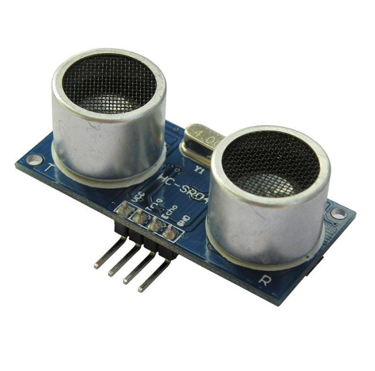

# Week 6 (Wednesday): The Ultrasonic Sensor

## Objective
> To interface an HC-SR04 ultrasonic distance sensor with the Raspberry Pi Pico W using CircuitPython. The goal was to understand acoustic physics ("Time-of-Flight" calculations), manage sensor libraries, and safely handle mixed-voltage logic levels.



## Hardware Theory: The HC-SR04
The HC-SR04 does not actually measure distance; it measures *time*. It operates using the exact same echolocation principle that bats use. 


### The 4 Pins:

1. **VCC:** Power.
2. **GND:** Ground (0V).
3. **TRIG (Trigger):** The microcontroller sends a tiny 10-microsecond `HIGH` pulse to this pin. This tells the sensor to blast a burst of 8 ultrasonic sound waves (at 40 kHz, above human hearing) into the air.
4. **ECHO:** After the sound fires, this pin goes `HIGH`. It stays `HIGH` while the sound travels through the air, bounces off an object, and returns. Once the sensor hears the echo, this pin drops back to `LOW`.

### The Physics (Math)
By measuring exactly how long the ECHO pin stayed `HIGH`, we know the total round-trip flight time of the sound wave. 

Since the speed of sound in air is relatively constant ($343 \ m/s$, or $0.0343 \ cm/\mu s$), we calculate the distance using this formula:
$Distance = \frac{Time \times 0.0343}{2}$
*(Note: We divide by 2 because the sound had to travel to the object and back, and we only want the distance to the object).*

## CRITICAL HARDWARE SAFETY: Level Shifting
**The HC-SR04 operates at 5V, but the Raspberry Pi Pico W operates at 3.3V.**

* You can safely send a 3.3V Trigger signal to the sensor.
* However, the sensor will blast a **5V signal** back out of its ECHO pin into the Pico W. 

Feeding 5V directly into a 3.3V Pico pin can permanently damage the silicon. To wire this safely, you must create a **Voltage Divider** using two resistors (e.g., a $1k\Omega$ and a $2k\Omega$ resistor) on the ECHO wire to step the 5V signal down to a safe 3.3V before it enters the Pico.

## Software Setup: Adding Libraries
Because timing microsecond pulses in standard Python can be tricky due to how the interpreter handles memory, Adafruit provides a pre-written, highly optimized library to do the heavy lifting.

1. Download the **Adafruit CircuitPython Library Bundle** for your specific version of CircuitPython.
2. Unzip it and locate the `adafruit_hcsr04.mpy` file.
3. Drag and drop that file directly into the `lib` folder on your `CIRCUITPY` drive.

## Firmware Implementation
With the library installed, calculating physical distance takes only a few lines of code.

```python
import time
import board
import adafruit_hcsr04

# Initialize the sensor
# TRIG is connected to GP14, ECHO is connected to GP15 (via voltage divider)
sonar = adafruit_hcsr04.HCSR04(trigger_pin=board.GP14, echo_pin=board.GP15)

print("Starting Ultrasonic Radar...")

while True:
    try:
        # The library does all the time-of-flight math automatically
        # and returns the distance in centimeters
        dist = sonar.distance
        print(f"Distance: {dist} cm")
        
    except RuntimeError:
        # The sensor throws a RuntimeError if it doesn't hear an echo 
        # (e.g., the object is too far away or absorbed the sound)
        print("Out of range!")
        
    # Wait 100ms before sending the next ping to avoid sound wave collisions
    time.sleep(0.1)
```

## Core Concepts Mastered

### 1. Time-of-Flight (ToF) Sensors
Transitioned from simple binary states (button ON/OFF) to translating acoustic timing data into physical spatial measurements.

### 2. Exception Handling (`try / except`)
Because physical environments are chaotic (sound waves scatter, objects absorb sound), the sensor will inevitably fail to read an echo occasionally. We used a `try / except` block to catch these `RuntimeErrors` gracefully, preventing the entire firmware from crashing when a single ping fails.

### 3. Logic Level Translation
Identified the critical engineering difference between operating voltage and logic voltage, and successfully implemented hardware mitigation (voltage dividers) to protect the 3.3V architecture from 5V logic.
